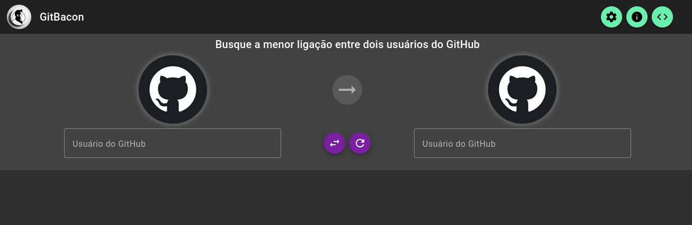
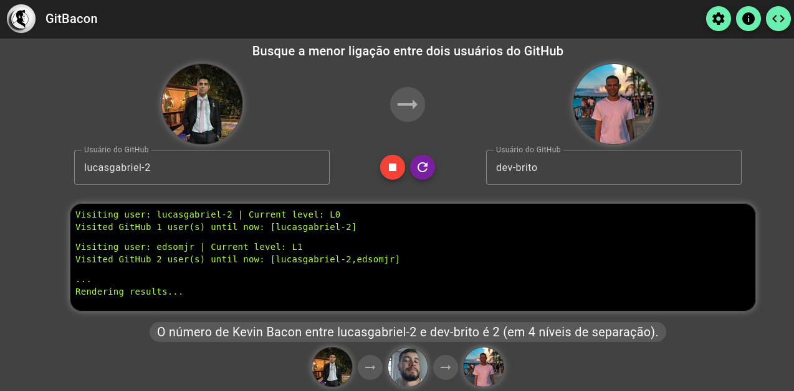
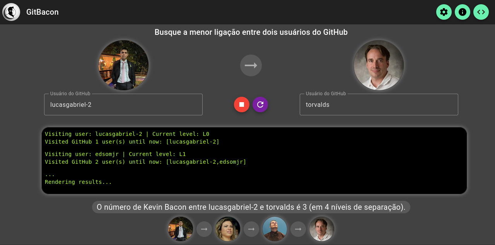
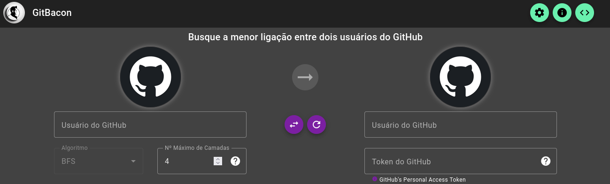
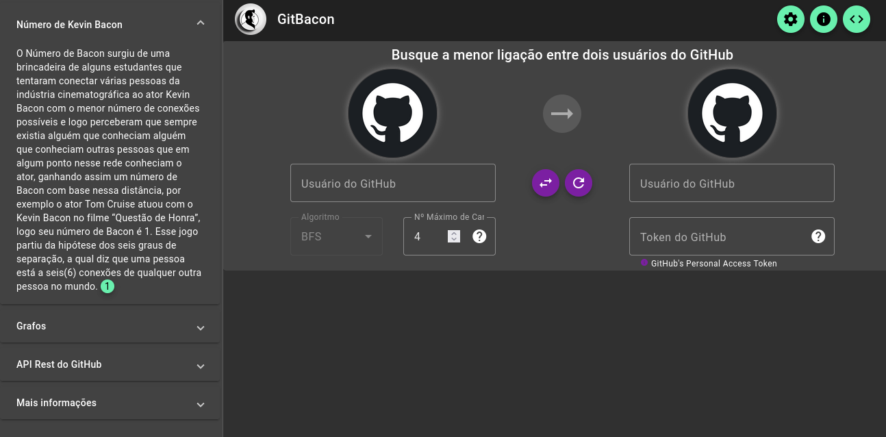

# GitBacon

**Número da Lista**: Dupla 06 (T01)<br>
**Conteúdo da Disciplina**: Grafos 1<br>

## Alunos

| Matrícula  | Aluno                                                                   |
|------------|-------------------------------------------------------------------------|
| 19/0112123 | [Lucas Gabriel Sousa Carmargo Paiva](https://github.com/lucasgabriel-2) |
| 20/0042327 | [Nicolas Chagas Souza](https://github.com/nszchagas)                    |

## Sobre

Esse projeto visa buscar a ligação mais curta entre dois usuários da plataforma GitHub, utilizando uma busca em largura (BFS) no grafo de usuários. A rede de usuários pode ser encarada como um grafo direcionado, onde cada usuário é um nó e as arestas são as ligações de "seguir". 

Os dados utilizados no projeto são disponibilizados pela API do GitHub. 


## Screenshots



<div style="text-align:center">Figura 1 - Tela Inicial.</div>



<div style="text-align:center">Figura 2 - Exemplo de Busca.</div>



<div style="text-align:center">Figura 3 - Exemplo de Busca.</div>



<div style="text-align:center">Figura 4 - Configurações de Busca.</div>


<div style="text-align:center">Figura 5 - Aba de informações.</div>

## Instalação

**Linguagem**: Typescript@4.9.4<br>
**Framework**: Angular@15.2.0<br>

Para rodar o projeto localmente é necessário ter Node (^20.0.0) e Angular (^15.2.0) instalado na máquina. Recomendamos a utilização do Node Version Manager (nvm) para instalação da versão correta do node. 

```shell

nvm install 20.0.0
nvm use 20.0.0
npm install angular@15.2.0 -g

```

- É **necessário** instalar as dependências do projeto, executando o seguinte comando na pasta raiz do projeto (a mesma onde se encontra o [package.json](./package.json).

```shell
npm install 
```

- Para rodar o projeto, basta executar o comando abaixo na raiz do projeto.

```shell
npm run start 
```

> Esse comando executará o script start definido no [package.json](./package.json), ou seja, iniciará o servidor angular expondo a porta padrão: 4200.

> Confira o aplicativo rodando em: [http://localhost:4200](http://localhost:4200). :)


## Uso

Para usar o projeto, acesse a página ([local](http://localhost:4200) ou no [github](https://projeto-de-algoritmos.github.io/Grafos1_GitBacon/)), preencha os usuários do GitHub desejados e após a validação a busca será iniciada. 

## Outros

As consultas à API do GitHub possuem um limite para usuários não autenticados (1000 requisições por hora), caso você deseje fazer várias buscas, esse número de requisições irá ultrapassar o limite, por esse motivo é possível configurar um token de acesso à API no projeto, basta clicar no ícone de configurações e preencher o campo 'token' com o seu token de acesso.  


## Referências

[1] Hotpot.ai - Ferramenta para geração de imagens com uso de inteligência artificial. Disponível no [link](https://hotpot.ai/), acesso em 29/04/2023. <br/>
[2] Breadth First Search or BFS for a Graph - GeeksForGeeks. Disponível no [link](https://www.geeksforgeeks.org/breadth-first-search-or-bfs-for-a-graph/), acesso em 29/04/2023. <br/>
[3] Tracing the Path in DFS, BFS, and Dijkstra’s Algorithm - Baeldung. Disponível no [link](https://www.baeldung.com/cs/dfs-vs-bfs-vs-dijkstra), acesso em 20/04/2023.<br/>

